# Blog

## General Info

Following Greg Liam's book 'Beginning, Node.js, Express & MongoDB Development' and created a blog site. Backend mostly follows the books direction with a litle touch of my own. Frontend is mostly custom made, inspired by Bootstrap template "Clean Blog". Example images below!

## Technologies

- [Express](https://github.com/expressjs/express)
- [Express-session](https://github.com/expressjs/session)
- [Connect-mongo](https://github.com/jdesboeufs/connect-mongo)
- [Mongoose](https://github.com/Automattic/mongoose)
- [Bootstrap](https://github.com/twbs/bootstrap)
- [Sass](https://github.com/sass/sass)
- [jQuery](https://github.com/jquery/jquery)
- [BCrypt](https://github.com/kelektiv/node.bcrypt.js/)
- [Body-parser](https://github.com/expressjs/body-parser)
- [Connect-flash](https://github.com/jaredhanson/connect-flash)
- [EJS](https://github.com/mde/ejs)
- [Express-fileupload](https://github.com/richardgirges/express-fileupload)
- [Mongoose-unique-validator](https://github.com/blakehaswell/mongoose-unique-validator)

## Installation

Download or clone this repository, then run the following command:

```
$ npm install
```

Create a .env file in directory and add:

- DATABASE_URL
- SESSION_SECRET

When all that is done, you're all set up and ready to use the system!
I recommend to set up nodemon and eslint for easy debug and usage.
Server is listening on localhost:3000 in dev enviroment.
Run the following command for server start:

```
$ npm start
```
## Directory

.
├── README.md
├── controllers
│   ├── getPost.js
│   ├── getUser.js
│   ├── home.js
│   ├── login.js
│   ├── loginUser.js
│   ├── logout.js
│   ├── newPost.js
│   ├── newUser.js
│   ├── search.js
│   ├── searchPost.js
│   ├── storePost.js
│   └── storeUser.js
├── index.js
├── node_modules
├── middleware
│   ├── authMiddleware.js
│   ├── redirectIfAuthenticatedMiddleware.js
│   └── validationMiddleware.js
├── models
│   ├── BlogPost.js
│   └── User.js
├── package-lock.json
├── package.json
├── public
│   ├── assets
│   │   ├── favicon.ico
│   │   └── img
│   │       ├── bg.jpg
│   │       └── bg4k.jpg
│   ├── css
│   │   ├── styles.css
│   │   └── styles.css.map
│   ├── img
│   ├── js
│   │   └── scripts.js
│   └── scss
│       └── styles.scss
└── views
    ├── create.ejs
    ├── index.ejs
    ├── layouts
    │   ├── footer.ejs
    │   ├── header.ejs
    │   ├── navbar.ejs
    │   └── scripts.ejs
    ├── login.ejs
    ├── notfound.ejs
    ├── post.ejs
    ├── register.ejs
    ├── search.ejs
    └── user.ejs

## Author

- Created by [Niklas Strömberg](https://www.linkedin.com/in/niklas-str%C3%B6mberg-59b428169)

## Images

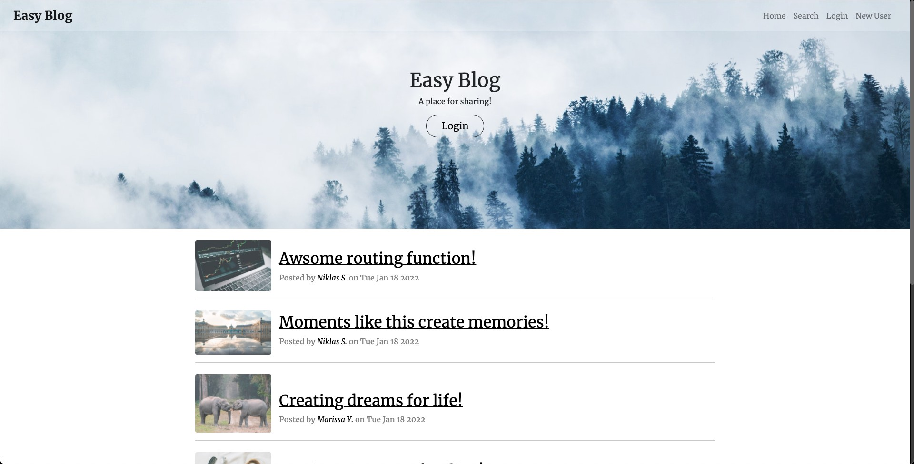
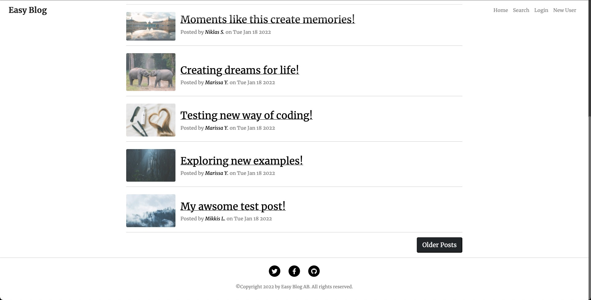
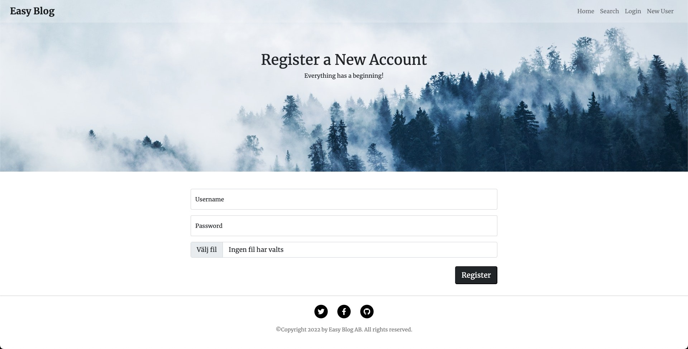
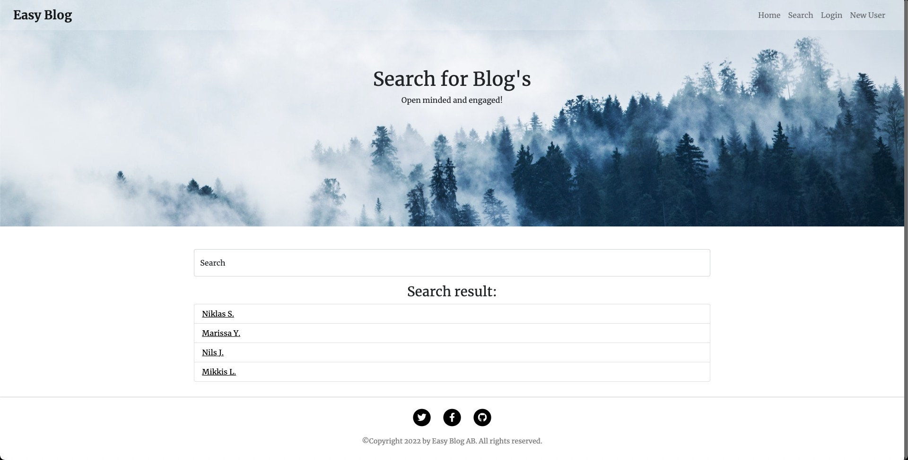
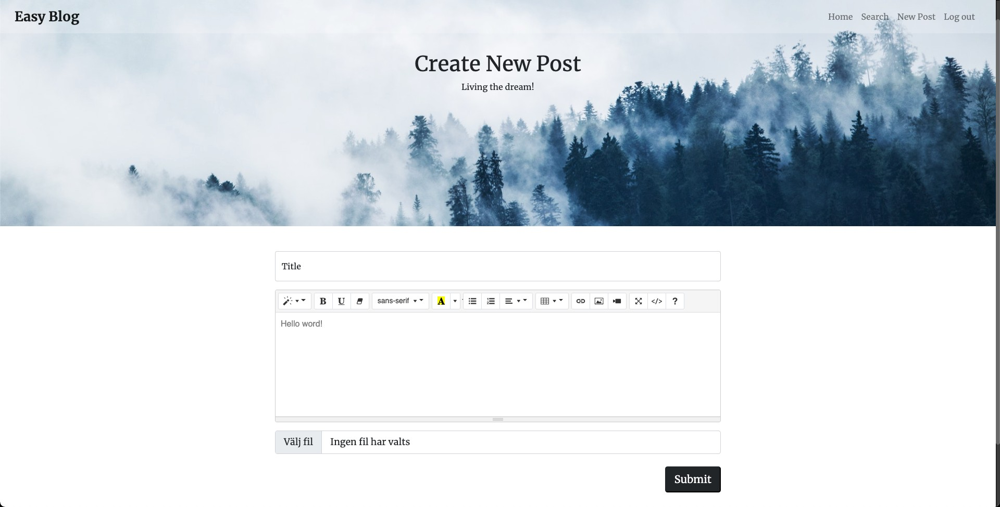
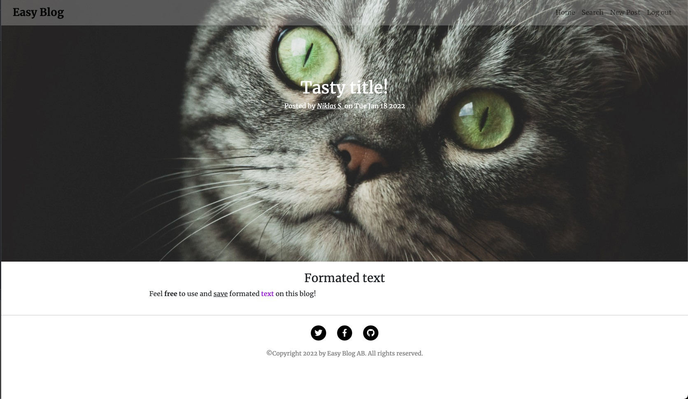
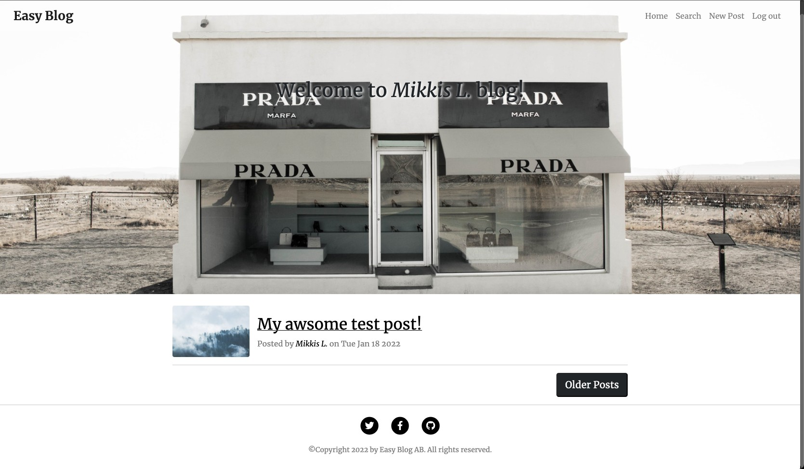
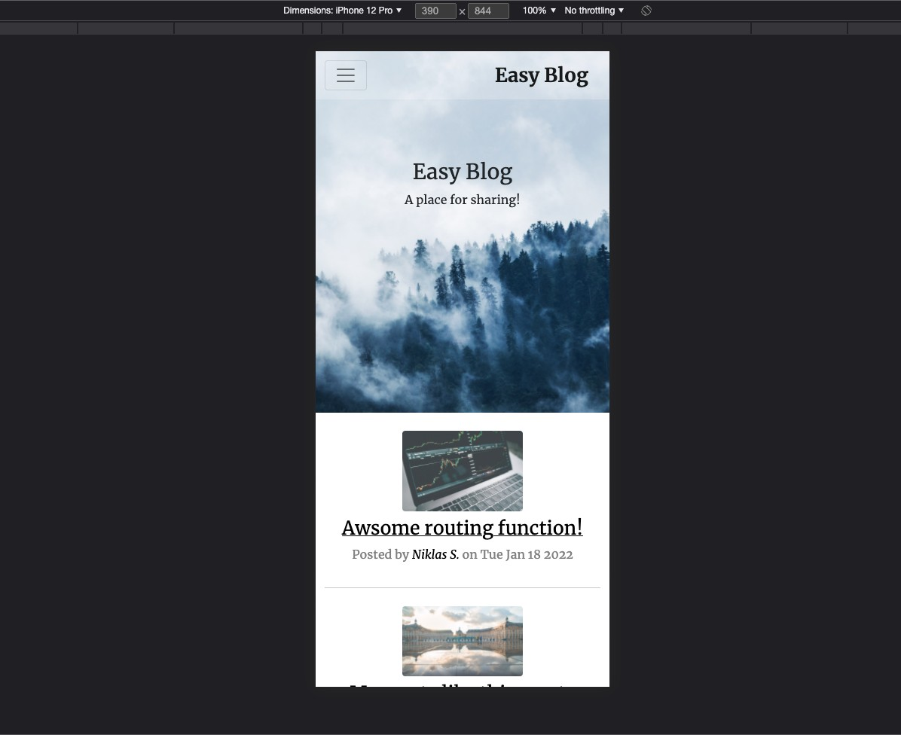
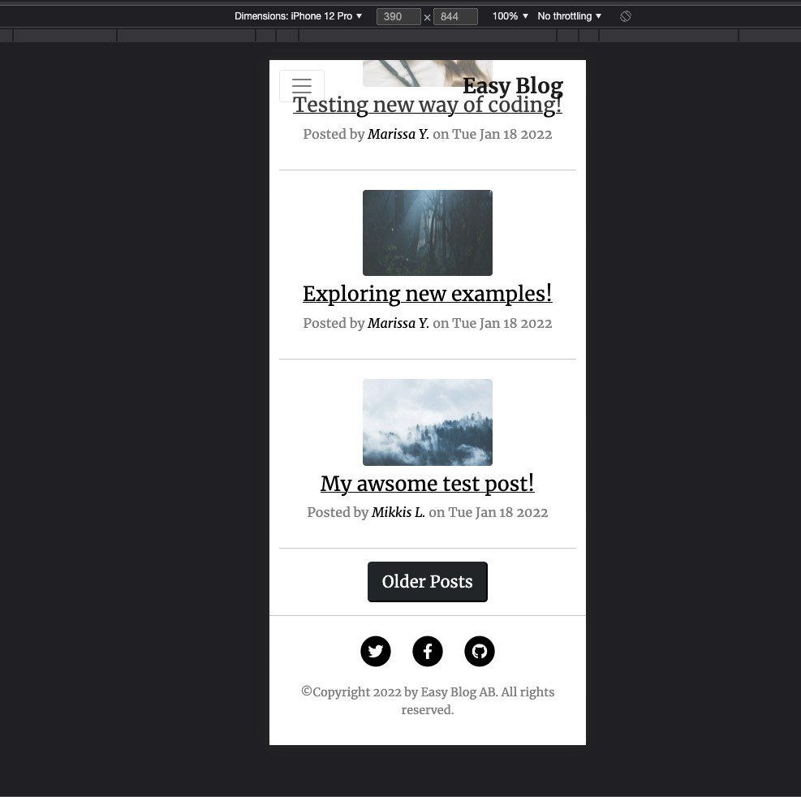
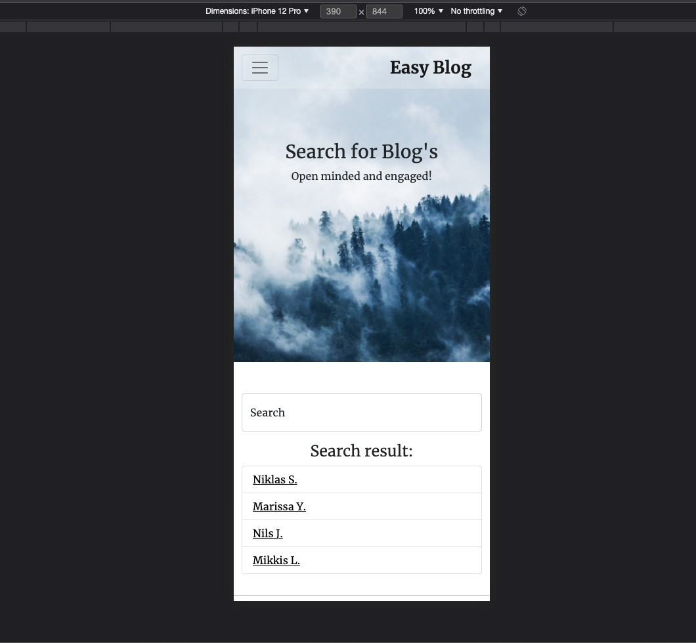
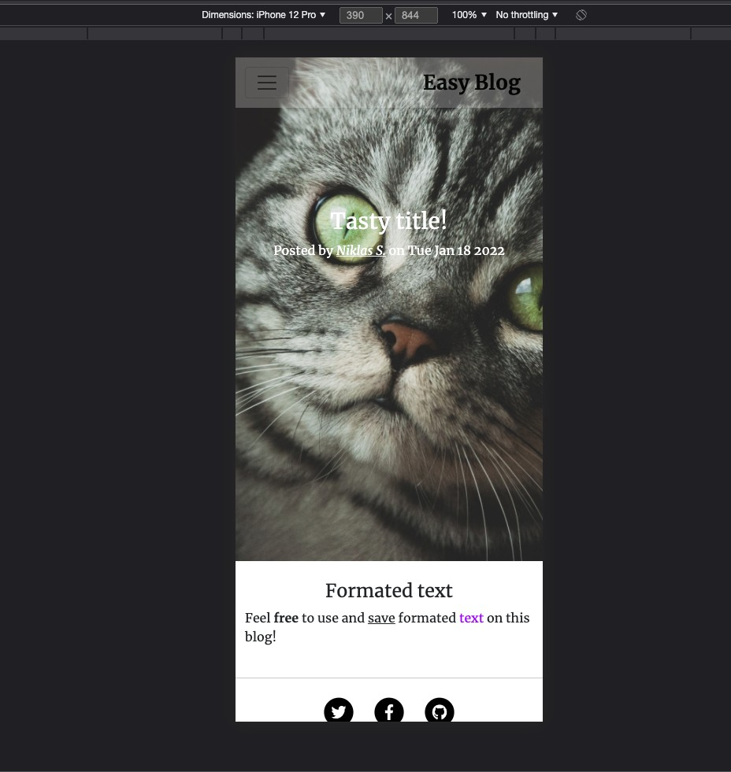